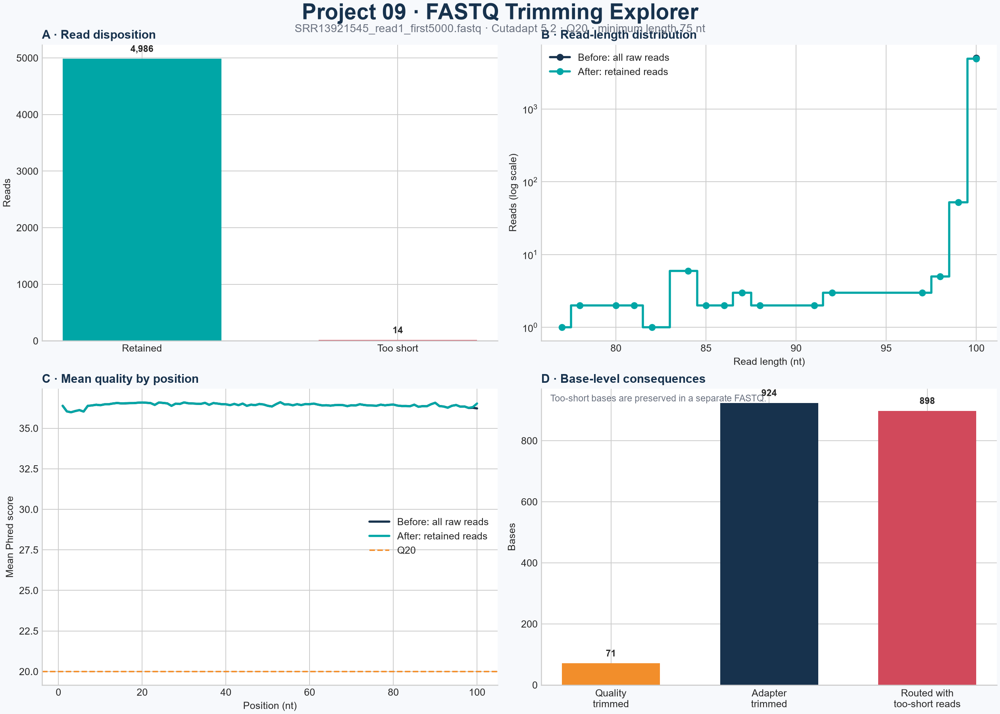

# FASTQ Trimming Explorer

[](https://github.com/pankhilpandya01-star/bioinformatics-project-09-fastq-trimming-explorer/actions/workflows/tests.yml)


[](LICENSE)

FASTQ Trimming Explorer is the tenth project in my bioinformatics learning
portfolio. It turns raw single-end FASTQ reads into analysis-ready reads through
traceable quality trimming, adapter trimming, and minimum-length filtering.

Projects 07 and 08 diagnosed read quality and sequence complexity without changing
the biological records. Project 09 takes the next step: it modifies reads, preserves
every intermediate decision, and verifies that the FASTQ files, per-read table,
Cutadapt reports, summary CSVs, and dashboard all tell the same story.

## Why I built this project

Read preprocessing is easy to describe as "remove low-quality bases and adapters,"
but a trustworthy workflow needs to answer more precise questions:

- Which reads changed at each stage?
- How many bases did quality and adapter trimming remove independently?
- Which reads became too short, and were they preserved for review?
- Did every input read reach exactly one final destination?
- Do the visual summaries agree with the underlying FASTQ and tool reports?

This project makes those consequences explicit instead of treating trimming as a
black box.

## Workflow

```text
Raw single-end FASTQ
        |
        v
Q20 3' quality trimming ----> Cutadapt JSON + intermediate FASTQ
        |
        v
3' adapter trimming --------> Cutadapt JSON + intermediate FASTQ
        |
        v
75 nt minimum-length routing -> retained FASTQ
                              -> preserved too-short FASTQ
                              -> Cutadapt JSON
        |
        v
Per-read accounting + before/after CSVs + four-panel dashboard
```

All three Cutadapt stages are separate. This prevents adapter-trimmed bases from
being confused with bases that remain inside reads routed to the too-short file.

## Verified result

The published analysis uses 5,000 authentic Illumina Read 1 records from
*Escherichia coli* K-12 MG1655.

| Metric | Result |
|---|---:|
| Input reads | 5,000 |
| Retained reads | 4,986 (99.72%) |
| Too-short reads preserved separately | 14 (0.28%) |
| Reads changed by Q20 trimming | 60 (1.20%) |
| Reads changed by adapter trimming | 42 (0.84%) |
| Reads changed by either stage | 102 (2.04%) |
| Quality-trimmed bases | 71 |
| Adapter-trimmed bases | 924 |
| Total trimmed bases | 995 (0.199%) |
| Analysis-ready retained bases | 498,107 (99.6214%) |
| Bases preserved in too-short reads | 898 |
| Mean base quality, before → after | Q36.4305 → Q36.4335 |
| Mean read length, before → after | 100.000 nt → 99.901 nt |

The effect is deliberately modest. This subset was already high quality, and the
workflow made targeted changes rather than removing a large fraction of the data.
All 14 too-short reads followed adapter trimming; none was deleted.



## What the program does

- validates the complete four-line FASTQ before launching Cutadapt;
- accepts uncompressed or gzip-compressed single-end FASTQ input;
- checks unique identifiers, IUPAC sequence symbols, Phred+33 characters, and
  sequence/quality length agreement;
- validates all CLI parameters before creating an output directory;
- requires Cutadapt 5.2 and runs each processing stage with one core;
- captures a JSON report and standard-output/error logs for every stage;
- retains quality- and adapter-trimmed intermediate FASTQ files;
- writes reads shorter than the configured threshold to a separate FASTQ;
- records original, post-quality, post-adapter, and final length for every read;
- verifies identifier and base-count agreement across FASTQ, CSV, and JSON files;
- calculates before/after read-length and Phred-quality summaries;
- creates positional-quality CSVs and a four-panel dashboard;
- checks that the input SHA-256 remains unchanged; and
- publishes the output directory atomically only after every check succeeds.

## Default parameters

| Parameter | Default | Meaning |
|---|---:|---|
| `--adapter` | `AGATCGGAAGAGCACACGTCTGAACTCCAGTCA` | Illumina Read 1 trimming sequence |
| `--quality-cutoff` | 20 | 3-prime Phred quality cutoff |
| `--minimum-length` | 75 | Minimum retained length in nucleotides |
| `--minimum-overlap` | 8 | Minimum adapter/read overlap |
| `--error-rate` | 0.1 | Maximum adapter-match error rate |

The error rate must be at least 0 and less than 1. Cutadapt interprets values of 1
or greater as an absolute number of errors, which is outside this CLI's rate-only
contract.

## Verified dataset

| Field | Value |
|---|---|
| SRA accession | [`SRR13921545`](https://www.ncbi.nlm.nih.gov/sra/SRR13921545) |
| Organism | *Escherichia coli* K-12 MG1655 |
| Library strategy | WGS |
| Source layout | Paired-end; this project uses Read 1 only |
| Platform / instrument | Illumina / NovaSeq 6000 |
| Bundled selection | Read 1, spots 1–5,000 |
| Records / bases | 5,000 / 500,000 |
| SRA Toolkit | 3.4.1 |
| Retrieved | 2026-08-05 |
| SHA-256 | `C3D708BA4B1C7EB4BB95DBAE6F7189F291250D129514F4D26B50AAD272FECC15` |

The subset was generated with:

```powershell
fastq-dump --split-files --skip-technical -X 5000 SRR13921545
```

Project 08's 5,000-read file passed a predeclared suitability gate because 2.04%
of reads changed, exceeding the 1% threshold. The planned fallback dataset was not
needed. See [data provenance](docs/data_provenance.md) and the original
[`source_metadata.csv`](data/source_metadata.csv).

## Installation

Python 3.12 is required.

```powershell
git clone https://github.com/pankhilpandya01-star/bioinformatics-project-09-fastq-trimming-explorer.git
cd bioinformatics-project-09-fastq-trimming-explorer
python -m venv .venv
.\.venv\Scripts\Activate.ps1
python -m pip install .
```

On macOS or Linux, activate the environment with `source .venv/bin/activate`.
The project pins Cutadapt 5.2 and Matplotlib 3.11.1 in `pyproject.toml`.

## Usage

Run a reproducible analysis of the bundled dataset into a new output directory:

```powershell
fastq-trimming-explorer `
  --fastq data/SRR13921545_read1_first5000.fastq `
  --adapter AGATCGGAAGAGCACACGTCTGAACTCCAGTCA `
  --quality-cutoff 20 `
  --minimum-length 75 `
  --minimum-overlap 8 `
  --error-rate 0.1 `
  --output-dir results/reproduction_run
```

The output directory must not already exist. This prevents accidental replacement
of an earlier analysis.

Display all options:

```powershell
fastq-trimming-explorer --help
```

The equivalent module command is:

```powershell
python -m fastq_trimming_explorer --fastq input.fastq.gz --output-dir results/new_run
```

## Output contract

| Artifact | Purpose |
|---|---|
| `01_quality_trimmed.fastq` | Post-Q20 intermediate containing every input read |
| `02_adapter_trimmed.fastq` | Post-adapter intermediate before length routing |
| `retained_reads.fastq` | Analysis-ready reads meeting the length threshold |
| `discarded_too_short.fastq` | Preserved reads below the threshold |
| `per_read_trimming.csv` | Input-ordered length, removal, and status record for every read |
| `before_after_summary.csv` | Raw-versus-retained length and quality metrics |
| `trimming_summary.csv` | Stage, routing, and base-accounting totals |
| `before_positional_quality.csv` | Raw per-position quality statistics |
| `after_positional_quality.csv` | Retained-read per-position quality statistics |
| `comparison_dashboard.png` | Four-panel result overview |
| `run_manifest.json` | Input checksum, versions, parameters, counts, and analysis metrics |
| `reports/*.cutadapt.json` | Machine-readable Cutadapt report for each stage |
| `logs/*.txt` | Captured Cutadapt standard output and error |

Reports, logs, and the run manifest use portable filenames instead of
machine-specific absolute paths.

Every successful run must satisfy:

```text
input reads = retained reads + too-short reads
input bases = quality-trimmed bases
            + adapter-trimmed bases
            + retained bases
            + bases preserved in too-short reads
```

## Testing and continuous integration

Run the standard-library test suite:

```powershell
python -m unittest discover -s tests -v
```

Ten passing tests cover malformed FASTQ, invalid values, known Q20 and adapter
examples, variable lengths, subprocess failures, atomic cleanup, empty routing
branches, identifier preservation, exact accounting, and a complete run over all
5,000 public reads.

GitHub Actions runs the same suite on Python 3.12 for pushes, pull requests, and
manual dispatches. See the [quality review](docs/quality_review.md) for the complete
acceptance matrix.

## Repository structure

```text
bioinformatics-project-09-fastq-trimming-explorer/
|-- .github/workflows/tests.yml
|-- data/
|   |-- SRR13921545_read1_first5000.fastq
|   `-- source_metadata.csv
|-- docs/
|   |-- analysis_review.md
|   |-- core_workflow_review.md
|   |-- data_provenance.md
|   |-- dataset_review.md
|   |-- limitations.md
|   |-- methods.md
|   |-- publication_checklist.md
|   |-- quality_review.md
|   `-- references.md
|-- results/
|   |-- controlled_demo/
|   |-- full_dataset/
|   `-- gate/
|-- src/fastq_trimming_explorer/
|   |-- analysis.py
|   |-- cli.py
|   |-- fastq.py
|   `-- workflow.py
|-- tests/
|   |-- fixtures/controlled.fastq
|   |-- test_fastq.py
|   `-- test_workflow.py
|-- LICENSE
|-- pyproject.toml
`-- README.md
```

## Interpretation and boundaries

- Quality and adapter matches are preprocessing signals, not proof that every
  removed base was biologically invalid.
- "After" statistics describe retained reads; too-short reads are reported
  separately and are not included in the after-quality curve.
- The 75 nt threshold is an explicit project choice, not a universal cutoff.
- Only Read 1 from a paired-end source run is analyzed. This workflow must not be
  used to filter one mate of paired data independently when synchronization matters.
- The NovaSeq instrument uses two-color chemistry, while this planned workflow uses
  regular Q20 trimming rather than Cutadapt's specialized NextSeq mode.
- The subset supports reproducibility but does not characterize the complete SRA
  run or other sequencing experiments.
- No alignment, assembly, contamination classification, FastQC/MultiQC integration,
  or variant analysis is performed.

See [methods](docs/methods.md), [limitations](docs/limitations.md), and
[references](docs/references.md) for the detailed scientific record.

## What I learned

- how to separate quality trimming, adapter trimming, and length routing so each
  consequence remains measurable;
- how Cutadapt's overlap and error-rate settings affect adapter detection;
- how to reconcile read- and base-level totals across FASTQ, CSV, and JSON files;
- how to preserve filtered reads instead of silently deleting them;
- how to generate positional-quality comparisons from Phred+33 scores;
- how atomic staging prevents partial scientific outputs after a failure; and
- how full-dataset tests and CI strengthen a reproducible bioinformatics project.

## Portfolio progression

Previous project:
[FASTQ Read-Complexity Explorer](https://github.com/pankhilpandya01-star/bioinformatics-project-08-fastq-read-complexity-explorer)

Project 08 measured whether reads were repetitive, ambiguous, or duplicated.
Project 09 moves from diagnosis to preprocessing by producing traceable,
analysis-ready trimmed reads. Paired-end synchronization and downstream mapping
remain deliberate future steps.

Browse the complete portfolio on the
[GitHub profile](https://github.com/pankhilpandya01-star?tab=repositories).

## License

This project is available under the [MIT License](LICENSE).
